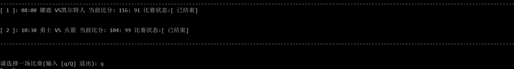
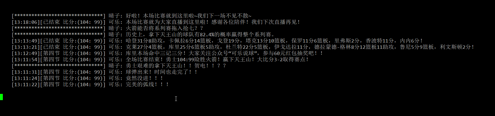

## 项目介绍

基于 Python3 标准库开发的命令行NBA文字直播。

数据来源：[新浪NBA](http://sports.sina.com.cn/nba/)

## 使用 

1. 启动

		git https://github.com/command-line-util/NBA-Text-Live.git
		cd NBA-Text-Live/
		python3 nba_live.py

2. 输入序号选择比赛。
3. 在比赛信息界面，`CTRL+C` 返回选择界面。

## 项目结构  

1. 接口放回的模板数据在 [json](./json) 目录。
2. 日志工厂类在 [log](./log) 目录。
3. 配置信息在 [config.cfg](config.cfg) 文件中。

	* logDir：日志目录。
	* delay: 每隔多少秒拉取一次。
	* showMessageSize：展示比赛信息的条数。

## 效果图

1. 选择界面。

	

2. 比赛信息界面。

	

